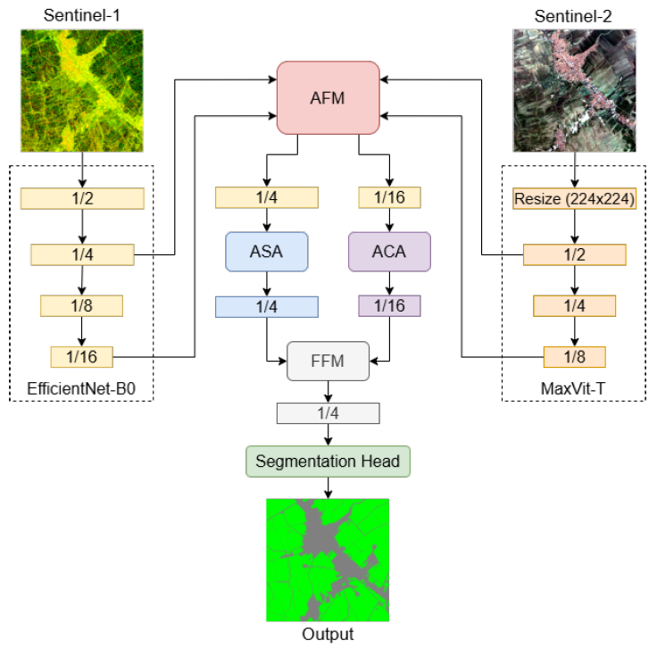

# DSSNet: Dual Stream Segmentation Networks

<p align="center">
  
</p>

## Overview
**DSSNet** is a semantic segmentation model.  

## Datasets
The datasets used in this study are publicly available:

- **Paddy Field Indramayu dataset**: [https://www.zenodo.com/](https://www.zenodo.com/)  

## Pretrained Weights
We provide pretrained weights for TerraSegNet models trained on multiple datasets:

- [Pretrained Models](https://drive.google.com/drive/)  

## Getting Started
### Requirements
- Python 3.11+
- PyTorch >= 2.3.1
- Torchvision >= 0.20

### Installation
Clone the repository:
```bash
git clone https://github.com/project4earth/DSSNet.git
cd DSSNet
